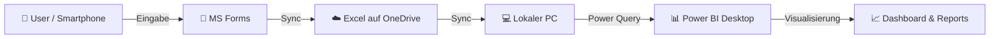

# 🏃‍♂️ Personal Fitness BI

**Automatisierte Fitness-Analyse: Von der mobilen Eingabe bis zum Dashboard.**

Eine vollständige End-to-End Business Intelligence Lösung für persönliches Fitnesstracking. Dieses Projekt ersetzt manuelle Excel-Listen durch einen automatisierten Workflow mit Microsoft Forms, Excel Online und Power BI.

## Über den Autor

**Andreas Traut** ist ein Senior BI-Entwickler, der sich auf Data Warehousing, SQL Server und Microsoft BI Stack spezialisiert hat.

🔗 [Vernetze dich auf LinkedIn](https://www.linkedin.com/in/andreas-traut-89340/)

🔗 [Schaue dir weitere, interessante BI Umsetzungen an](https://github.com/AndreasTraut)

---

## 🎯 Über das Projekt

Ziel dieses Projekts ist es, die Hürde der Datenerfassung zu minimieren und gleichzeitig professionelle Analysen zu ermöglichen. Anstatt Trainingsdaten mühsam am PC einzutippen, nutzt dieses System eine mobile "App" (MS Forms), die Daten in die Cloud synchronisiert. Power BI greift diese Daten ab, transformiert sie in ein professionelles Sternschema und visualisiert die Ergebnisse.

### Highlights & Features

* **Mobile-First Datenerfassung:** Eingabe von Dauer, Distanz und Herzfrequenz in < 30 Sekunden via Microsoft Forms.
* **Professionelles Datenmodell:** Nutzung eines Sternschemas (*Star Schema*) mit dedizierten Fakten- und Dimensionstabellen für performante Abfragen.
* **Automatisierte ETL-Strecke:** Power Query bereinigt technische Forms-Daten automatisch und konvertiert Minuten in Stunden.
* **Effizienz-Metriken:** Berechnung des "Efficiency Index" (Verhältnis von Geschwindigkeit zu Herzfrequenz) zur objektiven Fitnessbewertung.
* **Split-Screen Dashboard:** Übersichtliches Layout mit Trennung zwischen Detail-Daten (Matrix) und visuellen Trends (Diagramme).

---

## ⚙️ Architektur & Workflow

Der Datenfluss ist vollständig automatisiert ("Low-Code ETL"):

1.  **Input:** User trägt Training in Forms ein (via Smartphone-Link).
2.  **Storage:** Forms speichert Daten automatisch in einer Excel-Tabelle auf OneDrive.
3.  **Processing:** Power BI lädt die Daten über den lokalen OneDrive-Sync (stabilste Methode für private Accounts).
4.  **Output:** Interaktive Dashboards mit Drill-Down-Funktionen.

---

## 📂 Dokumentation

Die detaillierte Anleitung zur Replikation des Projekts findest du in den Docs:

* **[Einrichtung & Setup](docs/01_setup_forms.md)** – Wie man Forms und Excel verbindet.
* **[Datenanbindung](docs/02_datenanbindung.md)**  – Anleitung für den robusten lokalen Import (vs. Web-Connector).
* **[Datenmodellierung](docs/03_datenmodell.md)** – Erklärungen zu Fakten (`fact_Training`), Dimensionen (`dim_Kalender`, `dim_Trainingsarten`) und Beziehungen.
* **[KPIs & Logik](docs/04_kpis.md)** – Dokumentation der DAX-Measures in der `_Kennzahlen` Tabelle.
* **[Visualisierung](docs/05_visualisierung.md)** – Aufbau des Dashboards (Split-Layout).

---

## 🚀 Quick Start

1.  Repository klonen oder herunterladen.
2.  Excel-Template (`/templates/Fitness_Tracker_Template.xlsx`) auf dein OneDrive hochladen.
3.  Microsoft Form erstellen und mit dem Excel verknüpfen.
4.  Power BI Datei (`Personal Fitness BI.pbix`) öffnen.
5.  Datenquelle in den Einstellungen auf deinen eigenen OneDrive-Link ändern.
6.  Auf **Aktualisieren** klicken.

---

## 🛠 Tech Stack

* **Frontend:** Microsoft Forms (Web & Mobile)
* **Database:** Microsoft Excel Online (via OneDrive for Business/Personal)
* **Analytics Engine:** Power BI Desktop
* **Languages:** DAX (Data Analysis Expressions), M (Power Query)

## 🧠 Eingesetzte KI

Im Projekt wurden verschiedene KI‑Tools eingesetzt — jeweils dort, wo sie die Arbeit beschleunigen oder qualitativ verbessern. Alle KI‑Outputs wurden manuell geprüft und bei Bedarf angepasst.

- **Definition der Eingabedaten & Feld-Typen (Forms):** Entwurfsentscheidungen und Validierungsregeln mit [Google Gemini](https://developers.generativeai.google/) unterstützt. Siehe auch: [Einrichtung & Setup](docs/01_setup_forms.md).
- **Erstellung des Microsoft Forms Formulars:** Erstellung/Konfiguration mittels [Microsoft Copilot](https://www.microsoft.com/ai/copilot). Siehe: [Einrichtung & Setup](docs/01_setup_forms.md).    
- **Dokumentation des Stern‑Datenmodells (Mermaid-Diagramme):** Diagramme und Beschreibungen mit Unterstützung von [Google Gemini](https://developers.generativeai.google/) erstellt; [Mermaid](https://mermaid-js.github.io/mermaid/#/) wurde für die Diagramme verwendet. Siehe: [Datenmodellierung](docs/03_datenmodell.md).
- **DAX Measures:** Entwurf und Formulierung der Measures mit Hilfe von [Google Gemini](https://developers.generativeai.google/); Referenz: [KPIs & Logik](docs/04_kpis.md).    
- **Generierung & Überarbeitung der Markdown-Dokumentation:** Textentwürfe und Formulierungen mit [Google Gemini](https://developers.generativeai.google/) und [GitHub Copilot](https://github.com/features/copilot) erstellt und verfeinert. Siehe die `docs/`-Ordnerinhalte.
- **Commit-Nachrichten / Git‑Workflow-Hilfen:** Vorschläge für aussagekräftige Commit-Messages mithilfe von [GitHub Copilot](https://github.com/features/copilot).

## 🧰 Entwicklungstools

 * **[Visual Studio Code](https://code.visualstudio.com/)** — Editor für Entwicklung und Bearbeitung von Projektdateien, Markdown, DAX und Power Query (M).
* **[Power BI Desktop](https://powerbi.microsoft.com/)** — für Entwicklung und Testing der Berichte 
* **[Tabular Editor](https://tabulareditor.com/)** — Bearbeitung des Tabular/DAX-Modells (externes Tool)
* **[GitHub Desktop](https://desktop.github.com/)** — GUI für Git / GitHub-Workflows (optional)

