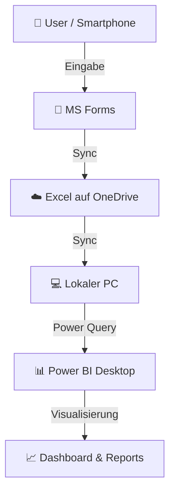

# 🏃‍♂️ Personal Fitness BI

**Von der Hantel direkt ins Dashboard – Fitness datengetrieben erreichen.**

Was man nicht misst, kann man nicht managen. Dieses Projekt ist eine vollständige End-to-End Business Intelligence Lösung, die manuelle Excel-Listen und intransparente Fitness-Apps durch einen automatisierten, professionellen Workflow ersetzt. Von der mobilen Datenerfassung (Microsoft Forms) über Cloud-Synchronisierung bis zum interaktiven Power BI Dashboard – alles läuft vollautomatisch im Hintergrund, während du dich auf dein Training konzentrierst.

## Über den Autor

**Andreas Traut** ist ein Senior BI-Entwickler, der sich auf Data Warehousing, SQL Server und Microsoft BI Stack spezialisiert hat.

🔗 [Vernetze dich auf LinkedIn](https://www.linkedin.com/in/andreas-traut-89340/)

🔗 [Schaue dir weitere, interessante BI Umsetzungen an](https://github.com/AndreasTraut)

---

## 🎯 Über das Projekt

Ziel dieses Projekts ist es, die Hürde der Datenerfassung zu minimieren und gleichzeitig professionelle Analysen zu ermöglichen. Anstatt Trainingsdaten mühsam am PC einzutippen, nutzt dieses System eine mobile "App" (MS Forms), die Daten in die Cloud synchronisiert. Power BI greift diese Daten ab, transformiert sie in ein professionelles Sternschema und visualisiert die Ergebnisse.

### Highlights & Features

* **Mobile-First Datenerfassung:** Eingabe von Dauer, Distanz und Herzfrequenz in < 30 Sekunden via Microsoft Forms.
* **Professionelles Datenmodell:** Nutzung eines Sternschemas (*Star Schema*) mit dedizierten Fakten- und Dimensionstabellen für performante Abfragen.
* **Automatisierte ETL-Strecke:** Power Query bereinigt technische Forms-Daten automatisch und konvertiert Minuten in Stunden.
* **Effizienz-Metriken:** Berechnung des "Efficiency Index" (Verhältnis von Geschwindigkeit zu Herzfrequenz) zur objektiven Fitnessbewertung.
* **Split-Screen Dashboard:** Übersichtliches Layout mit Trennung zwischen Detail-Daten (Matrix) und visuellen Trends (Diagramme).
* **Update v1.1 (Python Integration):** Nutzung von Python innerhalb von Power Query zur Simulation fehlender Daten (Mocking) und Berechnung komplexer Metriken (1RM). 👉 [Siehe Dokumentation](docs/06_python_integration.md)

## ⚙️ Architektur & Workflow

Der Datenfluss ist vollständig automatisiert ("Low-Code ETL"):

<table>
<tr>
<td width="50%">

```mermaid
graph TD
    User[📱 User / Smartphone] -->|Eingabe| Forms[📝 MS Forms]
    Forms -->|Sync| Excel[☁️ Excel auf OneDrive]
    Excel -->|Sync| Local[💻 Lokaler PC]
    Local -->|Power Query| PBI[📊 Power BI Desktop]
    PBI -->|Visualisierung| Dash[📈 Dashboard & Reports]
```

</td>
<td width="50%">

1.  **Input:** User trägt Training in Forms ein (via Smartphone-Link).
2.  **Storage:** Forms speichert Daten automatisch in einer Excel-Tabelle auf OneDrive.
3.  **Processing:** Power BI lädt die Daten über den lokalen OneDrive-Sync (stabilste Methode für private Accounts).
4.  **Output:** Interaktive Dashboards mit Drill-Down-Funktionen.

</td>
</tr>
</table>

---

## 🚀 Update v1.1: Python Integration
Power BI ist mächtig, aber für Data Science Workflows ist Python oft überlegen. Ich habe den Stack erweitert:

* **Hybrid ETL:** Power Query für Standard-Bereinigungen, Python (Pandas) für komplexe Logik.
* **Synthetic Data Injection:** Das Template enthält ein Python-Skript, das fehlende Krafttrainings-Daten (Gewicht/Wiederholungen) intelligent simuliert. So kannst du das Dashboard sofort mit "Leben" testen, auch wenn deine Excel-Tabelle noch leer ist.
* **Advanced Metrics:** Automatische Berechnung des **One Rep Max (1RM)** via Python-Skript.

👉 [Lies die Dokumentation zur Python-Integration](docs/06_python_integration.md)

---

## 📂 Dokumentation

Die detaillierte Anleitung zur Replikation des Projekts findest du in den Docs:

* **[Einrichtung & Setup](docs/01_setup_forms.md)** – Wie man Forms und Excel verbindet.
* **[Datenanbindung](docs/02_datenanbindung.md)**  – Anleitung für den robusten lokalen Import (vs. Web-Connector).
* **[Datenmodellierung](docs/03_datenmodell.md)** – Erklärungen zu Fakten (`fact_Training`), Dimensionen (`dim_Kalender`, `dim_Trainingsarten`) und Beziehungen.
* **[KPIs & Logik](docs/04_kpis.md)** – Dokumentation der DAX-Measures in der `_Kennzahlen` Tabelle.
* **[Visualisierung](docs/05_visualisierung.md)** – Aufbau des Dashboards (Split-Layout).

---

## 🚀 Quick Start

1.  Repository klonen oder herunterladen.
2.  Excel-Template (`/templates/Fitness_Tracker_Template.xlsx`) auf dein OneDrive hochladen.
3.  Microsoft Form erstellen und mit dem Excel verknüpfen.
4.  Power BI Datei (`Personal Fitness BI.pbix`) öffnen.
5.  Datenquelle in den Einstellungen auf deinen eigenen OneDrive-Link ändern.
6.  Auf **Aktualisieren** klicken.

---

## 🛠 Tech Stack

* **Frontend:** Microsoft Forms (Web & Mobile)
* **Database:** Microsoft Excel Online (via OneDrive for Business/Personal)
* **Analytics Engine:** Power BI Desktop
* **Languages:** DAX (Data Analysis Expressions), M (Power Query)

---

## 🧠 Eingesetzte KI: Google Gemini, Microsoft Copilot und GitHub Copilot

Im Projekt wurden verschiedene KI‑Tools eingesetzt — jeweils dort, wo sie die Arbeit beschleunigen oder qualitativ verbessern: 
* [Google Gemini](https://developers.generativeai.google/) — Unterstützung bei DAX‑Formulierungen und Dokumentations‑Entwürfen
* [Microsoft Copilot](https://www.microsoft.com/ai/copilot) — Automatisierte Erstellung/Konfiguration des Microsoft Forms Formulars
* [GitHub Copilot](https://github.com/features/copilot) — Vorschläge für Commit‑Messages und Markdown‑Überarbeitungen

Alle KI‑Outputs wurden manuell geprüft und bei Bedarf angepasst. Die genannten KI‑Tools wurden gezielt in einzelnen Projektphasen eingesetzt:

- **Definition der Eingabedaten & Feldtypen (Forms):** Entwurfsentscheidungen und Validierungsregeln mithilfe von Google Gemini erarbeitet.
- **Erstellung des Microsoft Forms‑Formulars:** Automatisierte Anlage und Konfiguration über Microsoft Copilot, anschließend überprüft. 
- **Dokumentation des Stern‑Datenmodells (Mermaid):** Diagramme, textliche Beschreibungen und [Mermaid](https://mermaid-js.github.io/mermaid/#/) für Diagramme mit Unterstützung von Google Gemini und GitHub Copilot erstellt. 
- **DAX‑Measures:** Entwurf, Formulierung und Variantenprüfung der Measures mit Google Gemini.
- **Markdown‑Dokumentation:** Textentwürfe und Überarbeitungen mit Google Gemini und GitHub Copilot erstellt und verfeinert. 
- **Commit‑Nachrichten / Git‑Workflow:** Vorschläge für aussagekräftige Commit‑Messages mithilfe von GitHub Copilot.

---

## 🧰 Entwicklungstools

 * **[Visual Studio Code](https://code.visualstudio.com/)** — Editor für Entwicklung und Bearbeitung von Projektdateien, Markdown, DAX und Power Query (M).
* **[Power BI Desktop](https://powerbi.microsoft.com/)** — für Entwicklung und Testing der Berichte 
* **[Tabular Editor](https://tabulareditor.com/)** — Bearbeitung des Tabular/DAX-Modells (externes Tool)
* **[GitHub Desktop](https://desktop.github.com/)** — GUI für Git / GitHub-Workflows (optional)
