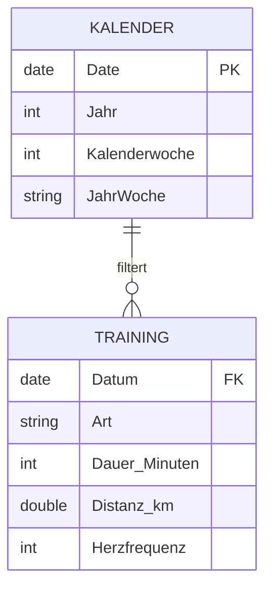

# 🧠 Das Datenmodell (Star Schema)

Wir verwenden ein klassisches **Sternschema**, den Industriestandard für Power BI, um performante Analysen und saubere Filterung zu gewährleisten.

## Struktur & Diagramm

* **Faktentabelle:** `Training` (Die Messwerte)
* **Dimensionstabelle:** `Kalender` (Die Zeitachse)


## Die Tabellen

### 1. Tabelle "Training" (Fakten)
Enthält die rohen Daten direkt aus dem Excel-Import. Jede Zeile repräsentiert eine Trainingseinheit. Hier finden keine Aggregationen statt.

### 2. Tabelle "Kalender" (Dimension)
Wird mittels DAX erstellt, um eine stetige Zeitachse zu garantieren (auch an Tagen ohne Sport).

**Wichtig:** Ermöglicht die korrekte Sortierung von Wochen (KW 1, KW 2...).

**DAX-Code für Kalender:**

```dax
Kalender = 
ADDCOLUMNS (
    CALENDAR (DATE(2025,1,1), DATE(2026,12,31)),
    "Jahr", YEAR([Date]),
    "Kalenderwoche", WEEKNUM([Date], 21),
    "JahrWoche", FORMAT([Date], "yyyy") & "-" & FORMAT(WEEKNUM([Date], 21), "00")
)
```

## Beziehungen
* **Verknüpfung:** `Kalender[Date]` -> `Training[Datum]`.
* **Kardinalität:** Eins-zu-viele (1:*).
* **Richtung:** Einfach (Kalender filtert Training).

