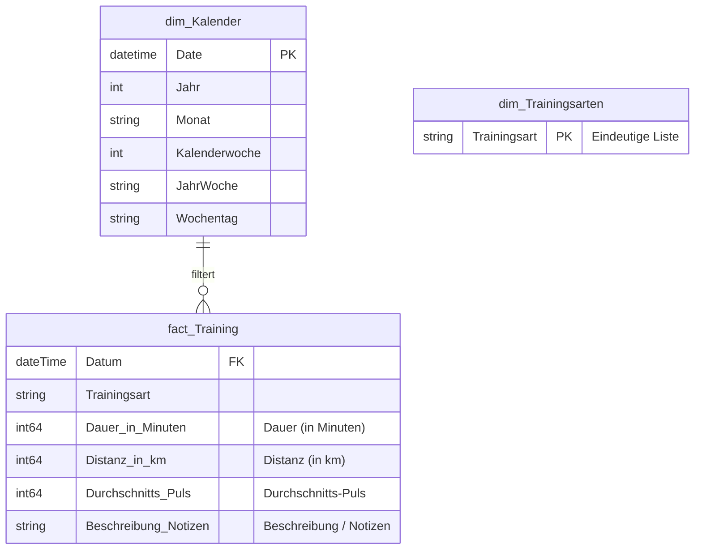

# 🧠 Das Datenmodell (Star Schema)

Wir verwenden ein klassisches **Sternschema**, den Industriestandard für Power BI, um performante Analysen und saubere Filterung zu gewährleisten.

## Struktur & Diagramm

* **Faktentabelle:** `fact_Training` (Die Messwerte)
* **Dimensionstabellen:** 
    * `dim_Kalender` (Die Zeitachse)
    * `dim_Trainingsarten` (Die Sportarten)
* **Measure-Tabelle:** `_Kennzahlen` (Container für Formeln)


## Die Tabellen

### 1. Tabelle "fact_Training" (Fakten)
Enthält die rohen Daten direkt aus dem Excel-Import. Jede Zeile repräsentiert eine Trainingseinheit. 

**ETL-Prozess (Power Query / M-Code):** Beim Import werden technische Spalten (ID, E-Mail) entfernt und Datentypen gesetzt.

```powerquery
let
    // 1. Zugriff auf die lokale Datei
    Quelle = Excel.Workbook(File.Contents("C:\Users\andre\OneDrive\Dokumente\Fraunhofer Data Scientist\Personal Fitness BI\Fitness.xlsx"), null, true),
    
    // 2. Navigation
    Tabelle1_Table = Quelle{[Item="Tabelle1",Kind="Table"]}[Data],
    
    // 3. Datentypen definieren
    #"Geänderter Typ" = Table.TransformColumnTypes(Tabelle1_Table,{
        {"ID", Int64.Type}, {"Startzeit", type datetime}, {"Wann war das Training?", type date}, 
        {"Was hast du gemacht?", type text}, {"Dauer (in Minuten)", Int64.Type}, 
        {"Distanz (in km)", Int64.Type}, {"Durchschnitts-Puls", Int64.Type}
    }),
    
    // 4. Cleanup & Umbenennung
    #"Entfernte Spalten" = Table.RemoveColumns(#"Geänderter Typ",{"Startzeit", "Fertigstellungszeit", "E-Mail", "Name"}),
    #"Umbenannte Spalten" = Table.RenameColumns(#"Entfernte Spalten",{
        {"Was hast du gemacht?", "Trainingsart"}, 
        {"Wann war das Training?", "Datum"}
    })
in
    #"Umbenannte Spalten"
```

### 2. Tabelle "dim_Kalender" (Dimension)
Wird mittels DAX erstellt, um eine stetige Zeitachse vom 01.01.2025 bis 31.12.2026 zu garantieren (auch an Tagen ohne Sport).

**Wichtig:** Ermöglicht die korrekte Sortierung von Wochen (KW 1, KW 2...).

**DAX-Code für Kalender:**

```dax
dim_Kalender = 
ADDCOLUMNS (
    CALENDAR (DATE(2025,1,1), DATE(2026,12,31)),
    "Jahr", YEAR([Date]),
    "Monat", FORMAT([Date], "mmmm"),
    "Kalenderwoche", WEEKNUM([Date], 21),
    "JahrWoche", FORMAT([Date], "yyyy") & "-" & FORMAT(WEEKNUM([Date], 21), "00"),
    "Wochentag", FORMAT([Date], "dddd")
)
```

## 3. Tabelle "dim_Trainingsarten" (Dimension)
Diese Tabelle wird dynamisch aus den Fakten generiert, um eine saubere Filtertabelle (z.B. für Slicer) bereitzustellen. Sie enthält jede Sportart genau einmal.

**M-Code:**

```powerquery
let
    // 1. Bezug auf die Faktentabelle nehmen
    // Wir laden die bereits existierende Tabelle "fact_Training" als Quelle.
    Quelle = fact_Training,

    // 2. Spaltenauswahl
    // Wir behalten nur die Spalte "Trainingsart" und entfernen alle anderen (Datum, Dauer etc.).
    // Das macht die Tabelle sehr schmal und performant.
    #"Andere entfernte Spalten" = Table.SelectColumns(Quelle,{"Trainingsart"}),
    
    // 3. Duplikate entfernen
    // Wir wollen jede Sportart (z.B. "Laufen") nur genau einmal in der Liste haben.
    // Das Ergebnis ist eine eindeutige Liste aller Sportarten für Filterzwecke.
    #"Entfernte Duplikate" = Table.Distinct(#"Andere entfernte Spalten")
in
    #"Entfernte Duplikate"
```

## 4. Tabelle "_Kennzahlen" (Measure-Container)
Eine spezielle Tabelle ohne Datenzeilen, die nur als Ordner für die DAX-Measures dient. Sie wird durch einen leeren Binary-Code erzeugt, um das "Taschenrechner"-Symbol in Power BI zu erhalten.

**Enthaltene Measures:**


* **Dauer (Std):** `SUM('fact_Training'[Dauer (in Minuten)]) / 60`
* **Distanz (km):** `SUM('fact_Training'[Distanz (in km)])`
* **Trainingseinheiten:** ` DISTINCTCOUNT( fact_Training[ID])` 
* **Ø kmh:** `DIVIDE( SUM('fact_Training'[Distanz (in km)]), [Dauer (Std)], 0 )` 
* **Ø Puls:** `DIVIDE( SUM('fact_Training'[Durchschnitts-Puls]), [Trainingseinheiten], 0 )`
* **Effizienz:** `DIVIDE( [Ø kmh], AVERAGE('fact_Training'[Durchschnitts-Puls]), 0 )`

## Beziehungen
Die Tabellen sind sternförmig um die Fakten angeordnet:

* **Verknüpfung:** 
	* Zeit-Dimension: `dim_Kalender[Date]` -> `fact_Training[Datum]` 
    * Sportart-Dimension: `dim_Trainingsarten[Trainingsart]` -> `fact_Training[Trainingsart]`
* **Kardinalität:** Eins-zu-viele. – Ein Tag im Kalender kann mehrere Trainings haben.
* **Richtung:** Einfach (Single) – Der Filter fließt vom Kalender zum Training.

