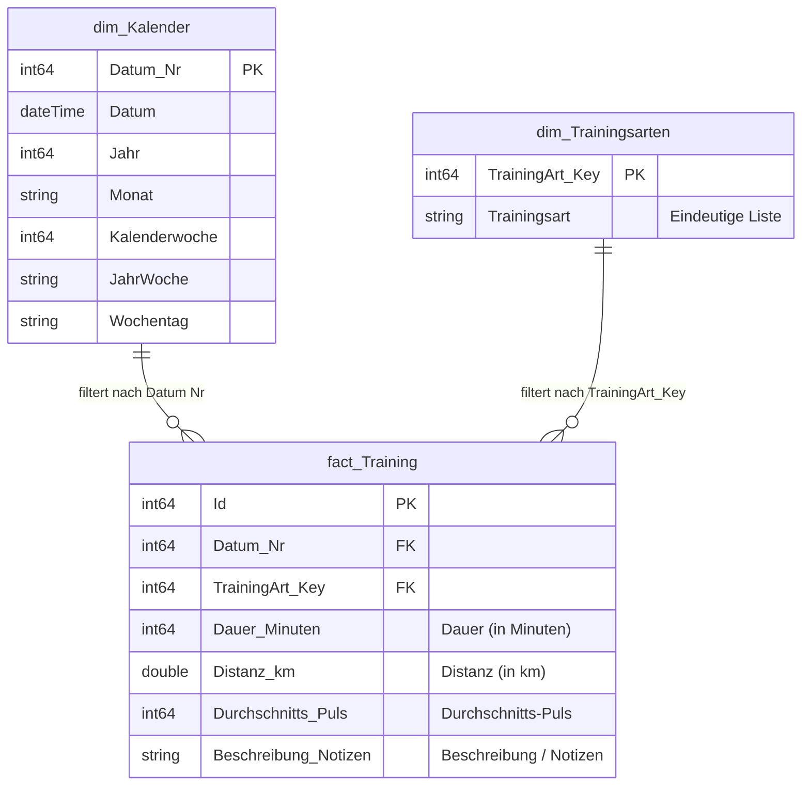

# 🧠 Das Datenmodell (Star Schema)

Wir verwenden ein klassisches **Sternschema**, den Industriestandard für Power BI, um performante Analysen und saubere Filterung zu gewährleisten.

## Struktur & Diagramm

* **Faktentabelle:** `fact_Training` (Die Messwerte)
* **Dimensionstabellen:** 
    * `dim_Kalender` (Die Zeitachse)
    * `dim_Trainingsarten` (Die Sportarten)
* **Measure-Tabelle:** `_Kennzahlen` (Container für Formeln)



## Die Tabellen

### 1. Tabelle "fact_Training" (Fakten)
Enthält die bereinigten Messwerte mit numerischen Schlüsseln für performante Beziehungen zu den Dimensionen. Jede Zeile repräsentiert eine Trainingseinheit. 

**ETL-Prozess (Power Query / M-Code):** Die Faktentabelle bezieht sich auf die Staging-Tabelle `source_Training` und verknüpft sie mit den Dimensionen, um numerische Schlüssel zu erhalten. Technische Spalten und Textfelder werden entfernt.

```powerquery
let
    // 1. Zugriff auf die aufbereitete Staging-Tabelle (Ihre bereinigte Quelle)
    Quelle = source_Training,

    // 2. Lookup der Trainingsart-ID: 
    // Wir verknüpfen die Fakten mit der Dimension "dim_Trainingsarten", um den numerischen Schlüssel zu erhalten.
    #"Zusammengeführte Abfragen" = Table.NestedJoin(Quelle, {"Trainingsart"}, dim_Trainingsarten, {"Trainingsart"}, "dim_Trainingsarten", JoinKind.LeftOuter),

    // 3. Extraktion des Schlüssels: 
    // Nur die Spalte "TrainingArt_Key" wird aus der Dimensionstabelle übernommen.
    #"Erweiterte dim_Trainingsarten" = Table.ExpandTableColumn(#"Zusammengeführte Abfragen", "dim_Trainingsarten", {"TrainingArt_Key"}, {"TrainingArt_Key"}),

    // 4. Bereinigung der Faktentabelle: 
    // Wir entfernen Metadaten (E-Mail, Name) und die ursprünglichen Textfelder.
    // Das Feld "Datum" wird hier entfernt, da wir bereits die "Datum Nr" (DateKey) für die Relation zur Zeit-Dimension haben.
    #"Entfernte Spalten" = Table.RemoveColumns(#"Erweiterte dim_Trainingsarten",{"Startzeit", "Fertigstellungszeit", "E-Mail", "Name", "Trainingsart", "Datum"})
in
    #"Entfernte Spalten"
```

### 2. Tabelle "dim_Kalender" (Dimension)
Wird mittels DAX erstellt, um eine stetige Zeitachse vom 01.01.2025 bis 31.12.2026 zu garantieren (auch an Tagen ohne Sport). Die Tabelle ermöglicht die korrekte Sortierung von Wochen (KW 1, KW 2...) und die Spalte `Datum` ist als **Datumsspalte** markiert ("Mark as Date Table"), um Time-Intelligence-Funktionen in DAX zu ermöglichen.

**DAX-Code für Kalender:**

```dax
dim_Kalender = 

VAR StartDatum = DATE(2025, 1, 1)
VAR EndDatum = DATE(2026, 12, 31)
-- Erzeugt die Basistabelle mit der Standardspalte [Date]
VAR BasisKalender = CALENDAR(StartDatum, EndDatum)

RETURN
SELECTCOLUMNS (
    ADDCOLUMNS (
        BasisKalender,
        "Datum Nr", YEAR([Date]) * 10000 + MONTH([Date]) * 100 + DAY([Date]),
        "Jahr", YEAR([Date]),
        "Monat", FORMAT([Date], "mmmm"),
        "Kalenderwoche", WEEKNUM([Date], 2),
        "JahrWoche", FORMAT([Date], "yyyy") & "-" & FORMAT(WEEKNUM([Date], 21), "00"),
        "Wochentag", FORMAT([Date], "dddd")
    ),
    -- Hier definieren wir die Namen der Spalten für die fertige Tabelle
    "Datum", [Date], 
    "Datum Nr", [Datum Nr],
    "Jahr", [Jahr],
    "Monat", [Monat],
    "Kalenderwoche", [Kalenderwoche],
    "JahrWoche", [JahrWoche],
    "Wochentag", [Wochentag]
)
```

## 3. Tabelle "dim_Trainingsarten" (Dimension)
Diese Tabelle wird dynamisch aus den Fakten generiert, um eine saubere Filtertabelle (z.B. für Slicer) bereitzustellen. Sie enthält jede Sportart genau einmal.

**M-Code:**

```powerquery
let
    // 1. Bezug auf die Staging-Tabelle nehmen
    // Wir laden die bereits existierende Tabelle "source_Training" als Quelle.
    Quelle = source_Training,

    // 2. Spaltenauswahl
    // Wir behalten nur die Spalte "Trainingsart" und entfernen alle anderen (Datum, Dauer etc.).
    // Diese Spalte basiert auf dem Feld "Was hast du gemacht?" aus Ihren Quelldaten.
    #"Andere entfernte Spalten" = Table.SelectColumns(Quelle,{"Trainingsart"}),
    
    // 3. Duplikate entfernen
    // Wir wollen jede Sportart (wie z.B. "Schwimmen", "Radfahren", "Laufen" oder "Krafttraining") nur genau einmal in der Liste haben.
    // Das Ergebnis ist eine eindeutige Liste aller Sportarten, die als Filter im Sternschema dient.
    #"Entfernte Duplikate" = Table.Distinct(#"Andere entfernte Spalten"),

    // 4. Indexspalte als Schlüssel (Surrogate Key) hinzufügen
    // Wir erstellen einen numerischen Primärschlüssel (Ganzzahl), der für die Verknüpfung im Modell genutzt wird.
    // Dieser Schlüssel (z. B. 1 für Schwimmen, 2 für Radfahren) optimiert die Performance gegenüber Text-Verknüpfungen.
    #"Hinzugefügter Index" = Table.AddIndexColumn(#"Entfernte Duplikate", "TrainingArt_Key", 1, 1, Int64.Type)

in
    // Rückgabe der fertigen Dimensionstabelle "dim_Trainingsarten"
    #"Hinzugefügter Index"
```

## 4. Tabelle "_Kennzahlen" (Measure-Container)
Eine spezielle Tabelle ohne Datenzeilen, die nur als Ordner für die DAX-Measures dient. Sie wird durch einen leeren Binary-Code erzeugt, um das "Taschenrechner"-Symbol in Power BI zu erhalten.

**Enthaltene Measures:**


* **Dauer (Std):** `SUM('fact_Training'[Dauer (in Minuten)]) / 60`
* **Distanz (km):** `SUM('fact_Training'[Distanz (in km)])`
* **Trainingseinheiten:** `DISTINCTCOUNT( fact_Training[Id])` 
* **Ø kmh:** `DIVIDE( SUM('fact_Training'[Distanz (in km)]), [Dauer (Std)], 0 )` 
* **Ø Puls:** `DIVIDE( SUM('fact_Training'[Durchschnitts-Puls]), [Trainingseinheiten], 0 )`
* **Effizienz:** `DIVIDE( [Ø kmh], AVERAGE('fact_Training'[Durchschnitts-Puls]), 0 )`

## Beziehungen
Die Tabellen sind sternförmig um die Fakten angeordnet:

* **Verknüpfung:** 
	* Zeit-Dimension: `dim_Kalender[Datum Nr]` -> `fact_Training[Datum Nr]` 
    * Sportart-Dimension: `dim_Trainingsarten[TrainingArt_Key]` -> `fact_Training[TrainingArt_Key]`
* **Kardinalität:** Eins-zu-viele (1:n) – Ein Tag im Kalender kann mehrere Trainings haben, eine Sportart kann mehrfach vorkommen.
* **Richtung:** Einfach (Single) – Der Filter fließt von den Dimensionen zu den Fakten.

### Warum die Relation über ein Integer-Feld (`Datum Nr`) sinnvoll ist

Die Verknüpfung zwischen Kalender und Fakten erfolgt bewusst über das Integer-Feld `Datum Nr` (Format: YYYYMMDD, z.B. `20251201`) statt über ein klassisches Datumsfeld. Dies bringt mehrere entscheidende Vorteile:

**1. Höhere Performance**  
Tabular-Engines (wie die VertiPaq-Engine von Power BI) verarbeiten Ganzzahlen (Integers) deutlich schneller als Datums- oder Zeitwerte. Der Vergleich von `20251201` mit `20251201` erfordert weniger Rechenzyklen als der Vergleich komplexer Datumsstrukturen.

**2. Optimale Kompression**  
Integers lassen sich in spaltenbasierten Datenbanken extrem effizient komprimieren. Da das Modell viele Zeilen haben kann (z.B. bei täglichen Trainingseinträgen über Jahre), reduziert dies den Speicherbedarf erheblich und beschleunigt Scan-Vorgänge.

**3. Eindeutigkeit und Sicherheit**  
Ein Integer-Feld wie `20251201` ist eindeutig und repräsentiert exakt einen Tag. Bei Datumsfeldern besteht oft die Gefahr, dass versteckte Zeitanteile (Stunden, Minuten, Sekunden) enthalten sind – z.B. `01.12.2025 14:30:00` statt `01.12.2025 00:00:00`. Solche Abweichungen lassen eine Relation "zerbrechen", da die Werte dann nicht mehr exakt übereinstimmen. Mit dem Integer-Schlüssel ist diese Fehlerquelle ausgeschlossen.

